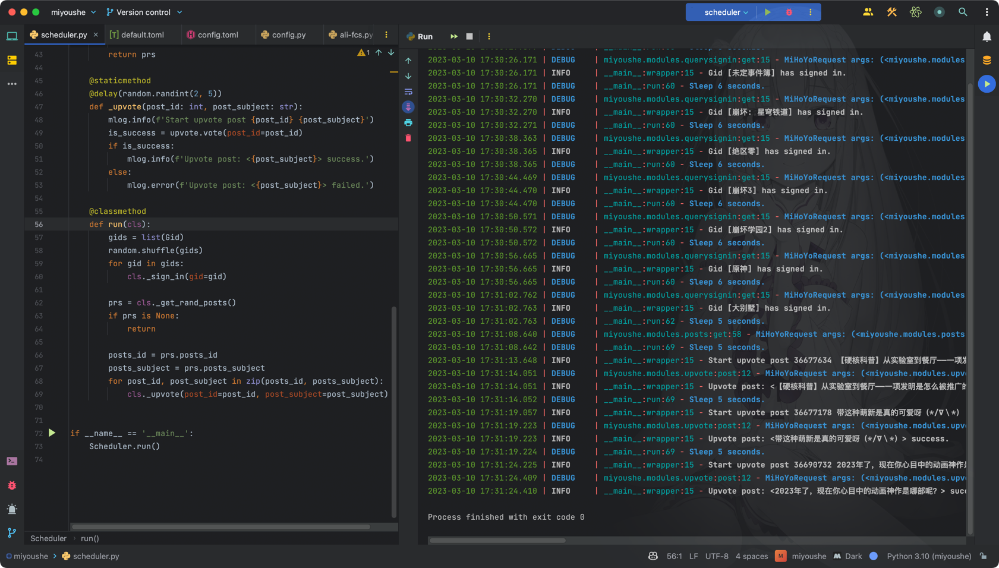

# mihoyo.hyperion

## TL;DR

米游社自动化脚本，使用Python实现。

初衷只是为了利用Python高级语法，提高代码可读性，减少代码量，提高代码复用性，减少代码维护成本。

## Implementation

- [x] 米游社签到, 包含当前所有板块
- [x] 米游社点赞
- [x] 米游社分享

## Usage

1. 安装依赖

    ```bash
    pip install -r requirements.txt
    ```
   
2. 复制并修改配置文件
    ```bash
    cp miyoushe/config/default.toml miyoushe/config/config.toml
    ```

    抓包获得Cookie并填入配置文件
    
    ```toml
    [account.cookies]
    stuid = ""
    stoken = ""
    mid = ""
    ```

3. 运行

    ```bash
    python3 scheduler.py
    ```

## License

[MIT](LICENSE)


## Preview


